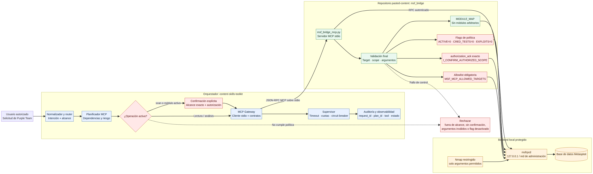

# Arquitectura del orquestador MCP con Metasploit

Este documento integra el puente MCP de Metasploit existente (`msf_bridge_mcp.py`) con un orquestador basado en `content-skills-toolkit`. La integración propuesta añade únicamente documentación y no modifica la lógica funcional del puente.

## Diagrama

La fuente editable está en [`ARQUITECTURA_ORQUESTADOR_MCP_MSF.mmd`](./ARQUITECTURA_ORQUESTADOR_MCP_MSF.mmd).

## Flujo

1. El usuario presenta una solicitud con alcance autorizado.
2. El orquestador normaliza la solicitud y selecciona capacidades MCP.
3. El planificador determina dependencias, riesgo y si la operación es activa.
4. Las operaciones de lectura o análisis pasan al gateway MCP.
5. Las operaciones activas quedan detenidas hasta una confirmación explícita.
6. El gateway usa JSON-RPC MCP sobre `stdio` para comunicarse con `msf_bridge_mcp.py`.
7. El puente aplica una segunda validación independiente antes de usar Metasploit RPC.
8. `msfrpcd` permanece en loopback o en una red de administración protegida.
9. El supervisor registra estado, duración, errores, cuotas y circuit-breaker.

## Restricciones representadas

- **Denegación por defecto:** `MSF_MCP_ENABLE_ACTIVE=0`, `MSF_MCP_ENABLE_CRED_TESTS=0` y `MSF_MCP_ENABLE_EXPLOITS=0`.
- **Allowlist obligatoria:** los targets deben estar cubiertos por `MSF_MCP_ALLOWED_TARGETS`.
- **Confirmación explícita:** `scan_target` y `execute_mapped_module` no se ejecutan automáticamente.
- **Reconocimiento de autorización:** las operaciones activas requieren `I_CONFIRM_AUTHORIZED_SCOPE`.
- **Módulos limitados:** solo se aceptan módulos incluidos en `MODULE_MAP`; no hay nombres arbitrarios.
- **Argumentos restringidos:** el puente valida target, scope, opciones y argumentos Nmap.
- **Transporte local:** el puente usa `stdio`; no se expone un endpoint administrativo de Metasploit a Internet.
- **Supervisión:** el gateway aplica timeout, cuotas, circuit-breaker y observabilidad.
- **Separación de barreras:** el orquestador controla el plan y el puente realiza la validación final.
- **Secretos fuera del código:** las credenciales RPC se inyectan mediante entorno o un gestor de secretos y no se registran.

## Integración con el repositorio existente

El repositorio `hubgunter4-ops/pasted-content` ya contiene el puente MCP y sus pruebas de política. Por eso no se crea un repositorio duplicado. La integración recomendada es añadir un cliente MCP stdio y un gateway en el orquestador externo, manteniendo `msf_bridge_mcp.py` como barrera final.

Archivos funcionales existentes que debe consumir el orquestador:

- `msf_bridge_mcp.py`: herramientas MCP y validación final.
- `msf_bridge.py`: cliente Metasploit RPC subyacente.
- `tests/test_mcp_policy.py`: validaciones de allowlist, scope y flags.
- `tests/test_mcp_protocol.py`: validaciones del protocolo MCP.

Esta entrega añade únicamente:

- `docs/ARQUITECTURA_ORQUESTADOR_MCP_MSF.mmd`
- `docs/ARQUITECTURA_ORQUESTADOR_MCP_MSF.png`
- `docs/ARQUITECTURA_ORQUESTADOR_MCP_MSF.md`

No se ejecutan Nmap, Metasploit RPC ni módulos activos como parte de esta documentación.
